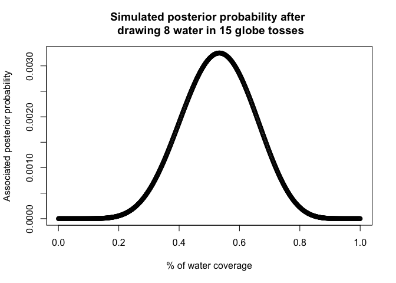
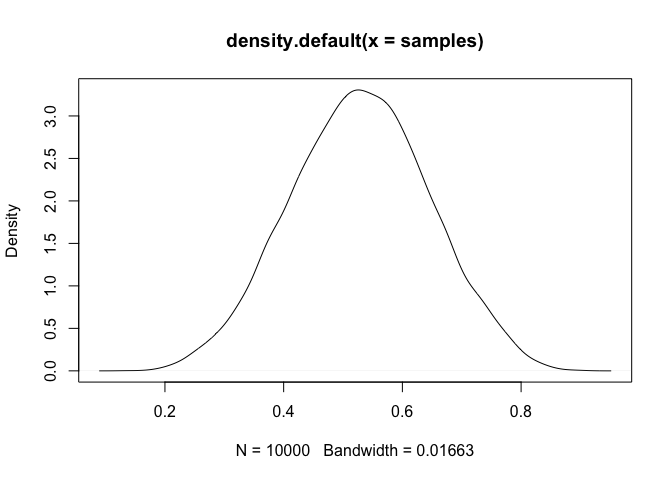
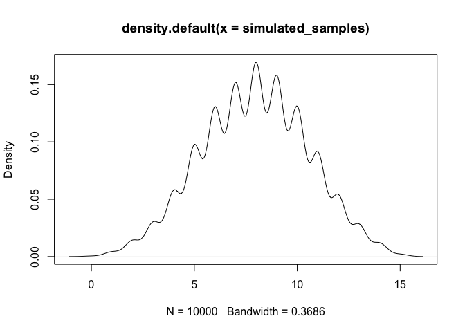

Chapter3
================

## What’s the Chapter about?

## Easy Questions

``` r
p_grid <- seq( from=0 , to=1 , length.out=1000 )
prior <- rep( 1 , 1000 )
likelihood <- dbinom( 6 , size=9 , prob=p_grid )
posterior <- likelihood * prior
posterior <- posterior / sum(posterior)
set.seed(100)
samples <- sample( p_grid , prob=posterior , size=1e4 , replace=TRUE )
```

### 3E1.

How much posterior probability lies below p = 0.2?

``` r
sum(samples < 0.2)/length(samples)
```

    ## [1] 4e-04

Ans: 0.04%

### 3E2.

How much posterior probability lies above p = 0.8?

``` r
sum(samples > 0.8)/length(samples)
```

    ## [1] 0.1116

Ans: 11.16%

### 3E3.

How much posterior probability lies between p = 0.2 and p = 0.8?

``` r
sum(samples > 0.2 & samples < 0.8)/length(samples)
```

    ## [1] 0.888

Ans 88.8%

### 3E4.

20% of the posterior probability lies below which value of p?

``` r
quantile(samples, 0.2)
```

    ##       20% 
    ## 0.5185185

Ans: 0.5185185

### 3E5.

20% of the posterior probability lies above which value of p?

Rephrase questions as 80% probaability lies *below* p. 

``` r
quantile(samples, 0.8)
```

    ##       80% 
    ## 0.7557558

Ans: 0.7557558

### 3E6.

Which values of p contain the narrowest interval equal to 66% of the
posterior probability?

Using the Highest Posterior Density Interval function from the
rethinking package, we get:

``` r
rethinking::HPDI(samples, prob=0.66)
```

    ##     |0.66     0.66| 
    ## 0.5085085 0.7737738

Ans: \[0.5085085, 0.7737738\]

### 3E7.

Which values of p contain 66% of the posterior probability, assuming
equal posterior probability both below and above the interval?

Using the Posterior Interval function from the rethinking package, we
get:

``` r
rethinking::PI(samples, prob=0.66)
```

    ##       17%       83% 
    ## 0.5025025 0.7697698

Ans: \[0.5025025,0.7697698\]

## Medium Questions

### 3M1.

Suppose the globe tossing data had turned out to be 8 water in 15
tosses. Construct the poste- rior distribution, using grid
approximation. Use the same flat prior as before.

``` r
p_grid <- seq( from=0 , to=1 , length.out=1000 )
prior <- rep( 1 , 1000 )
likelihood <- dbinom( 8 , size=15 , prob=p_grid )
posterior <- likelihood * prior
posterior <- posterior / sum(posterior)
plot(x=p_grid, y=posterior, xlab = "% of water coverage", ylab = "Associated posterior probability", main = "Simulated posterior probability after \n drawing 8 water in 15 globe tosses")
```

<!-- -->

### 3M2.

Draw 10,000 samples from the grid approximation from above. Then use the
samples to cal- culate the 90% HPDI for p.

``` r
set.seed(100)
samples <- sample( p_grid , prob=posterior , size=1e4 , replace=TRUE )
plot(density(samples))
```

<!-- -->

``` r
rethinking::HPDI(samples, prob=0.90)
```

    ##      |0.9      0.9| 
    ## 0.3343343 0.7217217

Ans: \[0.3343343, 0.7217217\]

### 3M3.

Construct a posterior predictive check for this model and data. This
means simulate the distribution of samples, averaging over the posterior
uncertainty in p. What is the probability of observing 8 water in 15
tosses?

``` r
p_grid <- seq( from=0 , to=1 , length.out=1000 )
prior <- rep( 1 , 1000 )
likelihood <- dbinom( 8 , size=15 , prob=p_grid )
posterior <- likelihood * prior
posterior <- posterior / sum(posterior)
set.seed(100)
samples <- sample( p_grid , prob=posterior , size=1e4 , replace=TRUE )
```

I think what McL is trying to do is something like

\[ P(X=8) = \sum_{\theta}(P(x = 8| \theta)P(\theta)) \] But, the path to
demonstrate this feels a bit circuitous. \(P(\theta)\) gets incorporated
into out calcs via the `samples` from the prior\_grid we pick above.
\((P(x = 8| \theta)\) gets incorporated via the simulated\_samples we
generate using `rbinom` below.

``` r
simulated_samples <- rbinom(1e4,15,samples)
plot(density(simulated_samples))
```

<!-- -->

``` r
sum(simulated_samples = 8)*100/length(simulated_samples) ## 8% chance?
```

    ## [1] 0.08

### 3M4.

Using the posterior distribution constructed from the new (8/15) data,
now calculate the probability of observing 6 water in 9 tosses.

### 3M5.

Startoverat 3M1, but now use a prior that is zero below p=0.5 and a
constant above p=0.5. This corresponds to prior information that a
majority of the Earth’s surface is water. Repeat each problem above and
compare the inferences. What difference does the better prior make? If
it helps, compare inferences (using both priors) to the true value p =
0.7.

### 3M6.

Suppose you want to estimate the Earth’s proportion of water very
precisely. Specifically, you want the 99% percentile interval of the
posterior distribution of p to be only 0.05 wide. This means the
distance between the upper and lower bound of the interval should be
0.05. How many times will you have to toss the globe to do this?

## Hard Questions

Introduction. The practice problems here all use the data below. These
data indicate the gender (male=1, female=0) of officially reported first
and second born children in 100 two-child families.So for example, the
first family in the data reported a boy (1) and then a girl (0). The
second family reported a girl (0) and then a boy (1). The third family
reported two girls.

``` r
birth1 <- c(1,0,0,0,1,1,0,1,0,1,0,0,1,1,0,1,1,0,0,0,1,0,0,0,1,0,
0,0,0,1,1,1,0,1,0,1,1,1,0,1,0,1,1,0,1,0,0,1,1,0,1,0,0,0,0,0,0,0,
1,1,0,1,0,0,1,0,0,0,1,0,0,1,1,1,1,0,1,0,1,1,1,1,1,0,0,1,0,1,1,0,
1,0,1,1,1,0,1,1,1,1)

birth2 <- c(0,1,0,1,0,1,1,1,0,0,1,1,1,1,1,0,0,1,1,1,0,0,1,1,1,0,
1,1,1,0,1,1,1,0,1,0,0,1,1,1,1,0,0,1,0,1,1,1,1,1,1,1,1,1,1,1,1,1,
1,1,1,0,1,1,0,1,1,0,1,1,1,0,0,0,0,0,0,1,0,0,0,1,1,0,0,1,0,0,1,1,
0,0,0,1,1,1,0,0,0,0)
```

### 3H1.

Using grid approximation, compute the posterior distribution for the
probability of a birth being a boy. Assume a uniform prior probability.
Which parameter value maximizes the posterior probability?

``` r
p_grid <- seq( from=0 , to=1 , length.out=1000 )
prior <- rep( 1 , 1000 )
n_births <- 100
likelihood <- dbinom( sum(birth1 + birth2) , size= 2*n_births, prob=p_grid )
posterior <- likelihood * prior
posterior <- posterior / sum(posterior)
```

``` r
p_grid[which.max(posterior)]
```

    ## [1] 0.5545546

Ans: Probability of birth being boy = 0.5545546 maximises the posterior.

### 3H2.

Using the sample function, draw 10,000 random parameter values from the
posterior distri- bution you calculated above. Use these samples to
estimate the 50%, 89%, and 97% highest posterior density intervals.

``` r
set.seed(100)
samples <- sample( p_grid , prob=posterior , size=1e4 , replace=TRUE )
```

``` r
rethinking::HPDI(samples, prob=c(0.50, 0.89, 0.97))
```

    ##     |0.97     |0.89      |0.5      0.5|     0.89|     0.97| 
    ## 0.4824825 0.4994995 0.5265265 0.5725726 0.6076076 0.6296296

Ans:  
|0.97 |0.89 |0.5 0.5| 0.89| 0.97| 0.4824825 0.4994995 0.5265265
0.5725726 0.6076076 0.6296296

### 3H3.

Use rbinom to simulate 10,000 replicates of 200 births. You should end
up with 10,000 num- bers, each one a count of boys out of 200 births.
Compare the distribution of predicted numbers of boys to the actual
count in the data (111 boys out of 200 births). There are many good ways
to visualize the simulations, but the dens command (part of the
rethinking package) is probably the easiest way in this case. Does it
look like the model fits the data well? That is, does the distribution
of predictions include the actual observation as a central, likely
outcome?

``` r
births_H3 <- rbinom(1e4, 200,prob = 0.5545546)
```

``` r
plot(density(births_H3))
abline(v=111, col="red",lty=2)
```

<!-- -->

Ans: Yeah, looks like a good fit, IMO.

### 3H4.

Now compare 10,000 counts of boys from 100 simulated first borns only to
the number of boys in the first births, birth1. How does the model look
in this light?

``` r
births_H4 <- rbinom(1e4, 100,prob = 0.5545546)
actual_boys_H4 <- sum(birth1)
```

``` r
plot(density(births_H4))
abline(v=actual_boys_H4, col="red",lty=2)
```

<!-- -->

Ans: Ooof, the fit looks off.

### 3H5.

The model assumes that sex of first and second births are independent.
To check this assumption, focus now on second births that followed
female first borns. Compare 10,000 simulated counts of boys to only
those second births that followed girls. To do this correctly, you need
to count the number of first borns who were girls and simulate that many
births, 10,000 times. Compare the counts of boys in your simulations to
the actual observed count of boys following girls. How does the model
look in this light? Any guesses what is going on in these data?

``` r
female_first_borns <- which(birth1 == 0)
births_post_female <- birth2[female_first_borns]
actual_boys_2ndborn <- sum(births_post_female)
```

``` r
births_H5 <- rbinom(1e4, length(female_first_borns), prob = 0.5545546)
simulated_boys_2ndborn <- mean(births_H5)
```

``` r
plot(density(births_H5), 
     xlab = "No of boys born", ylab = "Probability", main = "Predicted # of boys v/s Observed")
abline(v=actual_boys_2ndborn, col="red",lty=2)
```

<!-- -->
